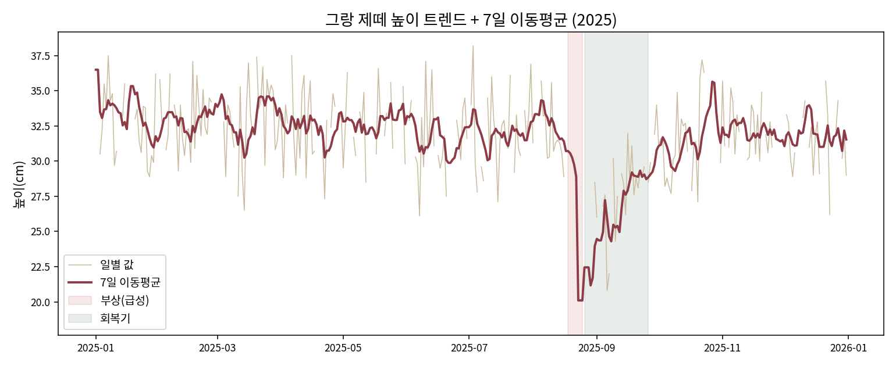
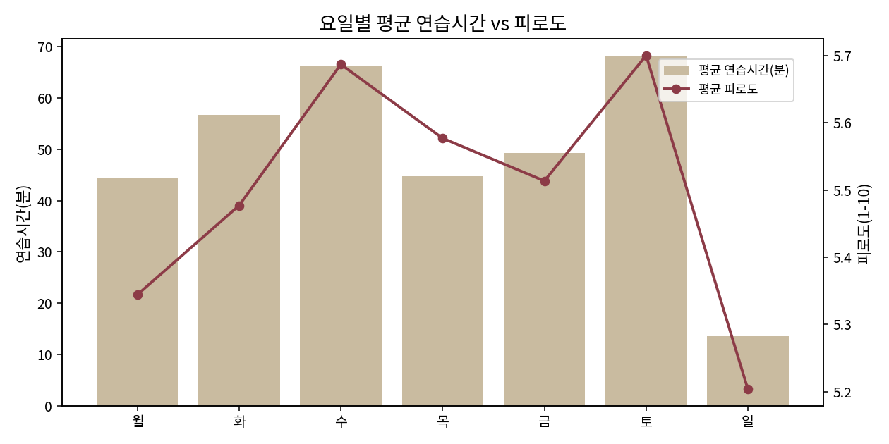
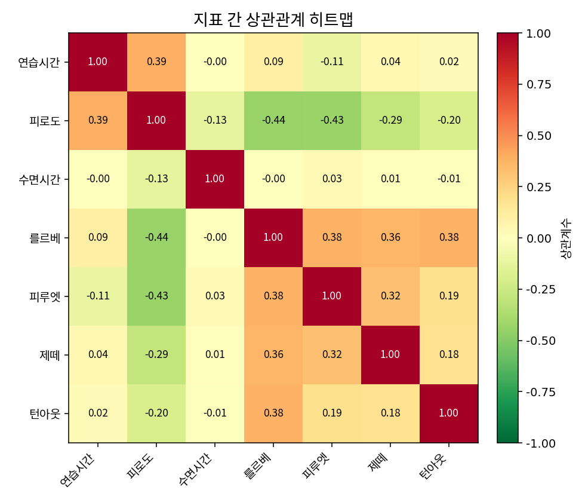
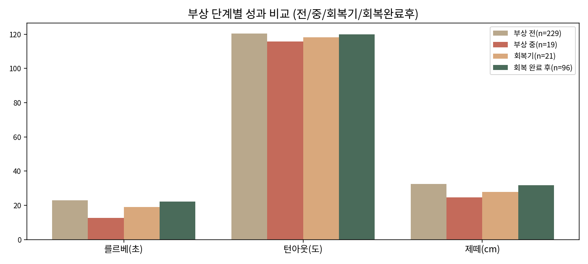
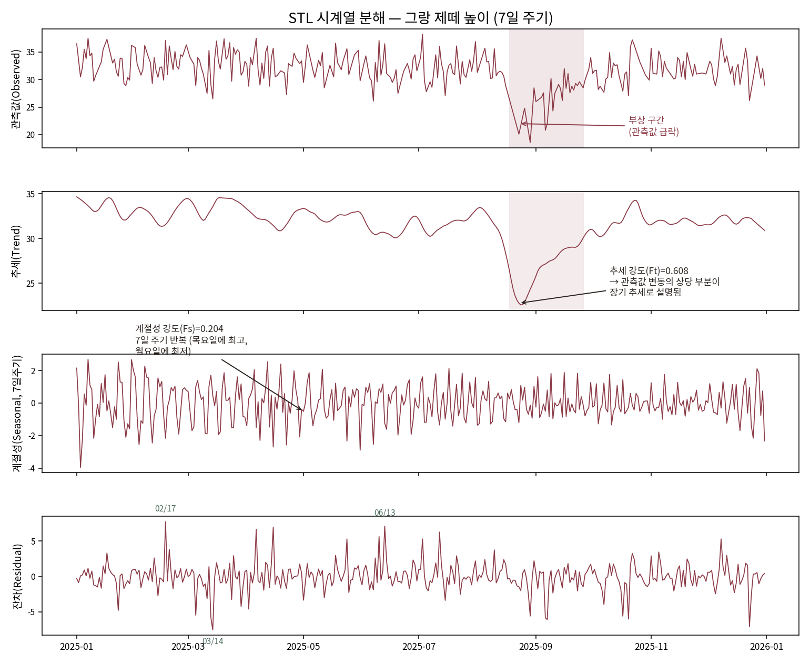
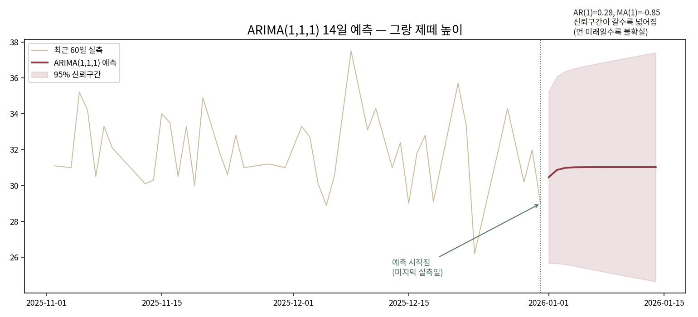
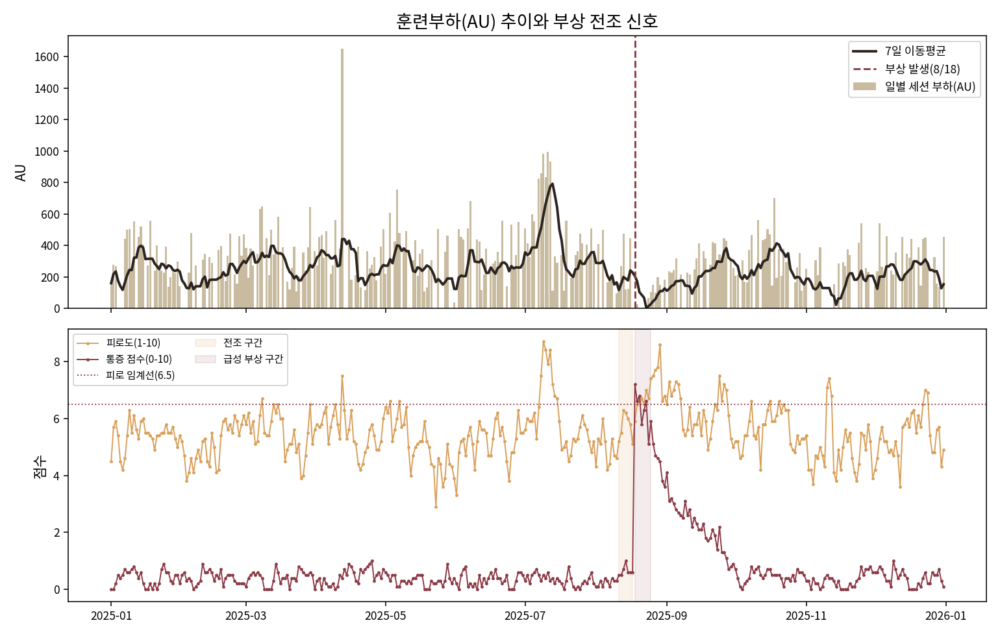
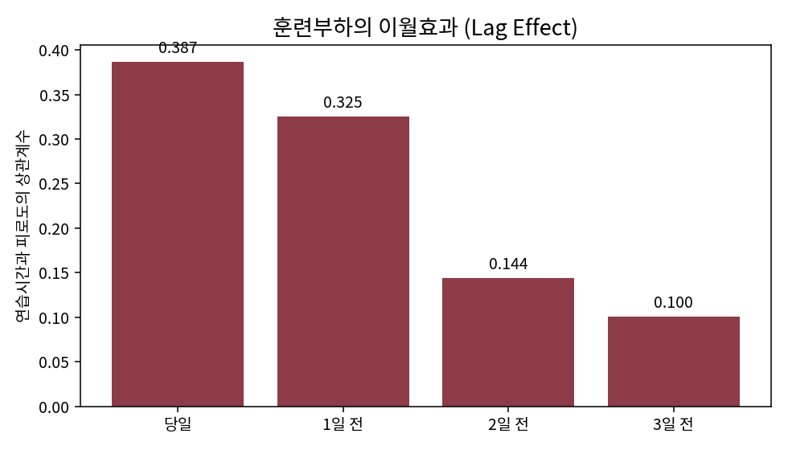
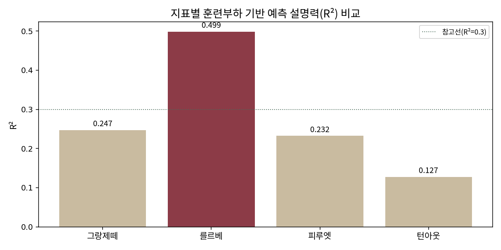

# 발레 훈련 365일 시계열 분석 리포트

## 1. 데이터 성격 및 목적

이 데이터는 실제 관측 데이터가 아니라, 본 과정의 "AI 응용1(시계열 분석)"과 "AI 응용2(AI 비서 구축)" 두 미션에 연속으로 활용할 목적으로 설계·생성한 합성 데이터입니다. 서로 다른 생성형 AI 여러 개를 오가며 교차 검증(생성 → 구조·수치 검토 → 보완 → 재검증)한 뒤 확정했으며, 응용1에서는 이 데이터의 시계열 패턴(추세·분해·예측)을 분석하고, 응용2에서는 동일 데이터를 Firestore에 저장해 AI 비서가 참조하는 컨텍스트로 재사용합니다.

따라서 본 리포트의 목적은 "실제 발레 생리학을 규명"하는 것이 아니라, "시계열 데이터에서 패턴을 발견하고, 관찰(사실)과 해석(가설)을 구분해 서술하는 분석 방법론"을 시연하는 데 있습니다.  
### 연구 근거

데이터를 합성할 때 다음 두 편의 실제 스포츠과학 문헌을 참고해 변수 설계의 개연성을 높였다(정확한 계수·사건 날짜·회복 기간까지 논문에서 가져온 것은 아니며, 그 부분은 시뮬레이션 가정임을 명시한다):

- Shaw, J. W. et al. (2020). *The Validity of the Session Rating of Perceived Exertion Method for Measuring Internal Training Load in Professional Classical Ballet Dancers.* Frontiers in Physiology, 11:480. https://doi.org/10.3389/fphys.2020.00480 — 전문 발레 무용수 대상으로 session-RPE(연습시간×RPE)가 내부 훈련부하 측정에 타당하다는 근거. 본 데이터의 `session_load_au` 설계가 이에 기반한다.
- Lee, L. et al. (2017). *Injury Incidence, Dance Exposure and the Use of the Movement Competency Screen (MCS) to Identify Variables Associated With Injury in Full-Time Pre-Professional Dancers.* International Journal of Sports Physical Therapy, 12(3), 352–370. https://pmc.ncbi.nlm.nih.gov/articles/PMC5455185/ — 댄스 노출량과 부상 위험 사이에 유의미한 연관이 있다고 보고하나, 특정 훈련시간 하나를 부상 임계값으로 제시하지는 않는다. 본 데이터에서도 부상을 "특정 AU 수치 초과"가 아니라 사건으로 다뤘다.

>검증 경과: 처음 참고하려던 세 번째 문헌("Lin et al. 2016, PMID 26955753")은 재현 검증 결과 해당 PMID가 이 주제와 무관한 논문을 가리키는 것으로 확인되어 인용에서 제외했다(9장 AI 사용 로그 참고).  

### 합성 데이터의 실질적 장점

1. **검증 가능한 "정답"이 존재합니다.** 실측 데이터는 이상치가 측정오류인지 진짜 현상인지 구분할 방법이 없지만, 합성 데이터는 생성 규칙을 역추적해 "왜 이 수치가 이렇게 나왔는지"를 검증할 수 있습니다. 본 프로젝트에서 event_type 표본 부족, JSON NaN 직렬화 버그, 4월/7월 AU 급증의 원인(집중워크숍·공연주간) 등을 전부 근거를 갖고 규명함. 
2. **AI 산출물을 검증하는 훈련을 실전처럼 할 수 있음.** 한 생성형 AI가 제시한 "상관관계 0.50~0.65로 감소", "자기상관계수 0.948", "±2.16cm로 정밀 예측 가능" 등의 주장을 재현 검증으로 반증한 사례들(9장 AI 사용 로그 참고)은, 정답을 알 수 없는 실측 데이터로는 명확히 검증하기 어려울 수 있음.
3. **1년치 데이터를 즉시 확보할 수 있음.** 실측이라면 1년을 기다려야 할 분량의 분석·시계열 기법·예측 모델링 연습을 곧바로 수행할 수 있음. 
4. **민감정보·윤리적 제약 없이 자유롭게 배포할 수 있음.** 실제 개인의 부상·통증 기록은 공개하기 어렵지만, 합성 데이터는 대시보드로 공개 배포하는 데 제약이 없음.
5. **응용2(AI 비서)로 이어지는 파이프라인을 설계 단계부터 고려할 수 있음.**  

요컨대 이 프로젝트의 산출물은 "발레에 대한 새로운 사실"이 아니라 **"데이터 분석 방법론과 AI 검증 역량"**이며, 그 학습 목표는 합성 데이터로도 충분히, 안전하게 달성됨.

## 2. 분석 주제 및 선정 이유

가상의 발레 훈련생 1인의 2025년 365일 훈련 기록을 통해, 훈련 부하·수면·부상이 기술 지표(를르베 균형, 피루엣, 그랑 제떼, 턴아웃)에 어떤 흐름을 보이는지 분석한다. 특히 2025-08-18~08-25 발목 부상 사건을 기준으로 전/중/회복 구간의 변화를 살펴본다.

## 3. 분석 질문 (3개 이상)

1. 1년간 훈련을 지속하면 기술 지표(그랑 제떼 등)가 장기적으로 상승하는 추세를 보이는가?
2. 요일에 따라 연습 강도와 피로도가 규칙적인 패턴을 보이는가? 특히 연습이 적은 날에도 피로도가 함께 낮아지는가, 아니면 전날의 영향이 남아있는가?
3. 부상은 기술 지표에 얼마나 영향을 주며, 회복 후 부상 이전 수준으로 완전히 복귀하는가?
4. 연습시간·수면·피로도 등 변수들은 서로 얼마나 강하게 연관되어 있는가?
5. 훈련부하(AU)로 부상이나 기술 지표를 예측할 수 있는가?

| 질문 | 답 |
|---|---|
| 1. 장기 상승 추세 여부 | 시각화 ① → 인사이트 4 |
| 2. 요일별 패턴 · 전날 영향 여부 | 시각화 ②⑨ → 인사이트 2 |
| 3. 부상의 영향과 완전 복귀 여부 | 시각화 ④ → 인사이트 3 |
| 4. 변수 간 상관관계 | 시각화 ③ → 인사이트 1 |
| 5. 훈련부하로 예측 가능한가 | 시각화 ⑦⑧ → 인사이트 5, 6 |

## 4. 데이터 설명

- 기간: 2025-01-01 ~ 2025-12-31 (365일, 결측 없이 전수)
- 컬럼: 날짜/요일, 훈련 상황(event_type), 연습시간, RPE, 세션 부하, 수면시간·질, 피로도, 통증 점수, 를르베 밸런스(초), 피루엣 회전수, 그랑 제떼 높이(cm), 턴아웃 각도(도), 측정 상태(measurement_status), 메모
- event_type 8종: normal(293~312), ankle_injury_acute/modified/recovery, performance_week, travel, mild_illness, intensive_workshop

### 기초통계량

| 변수 | 유효 n | 평균 | 중앙값 | 표준편차 | 최소 | Q1 | Q3 | 최대 |
|---|---|---|---|---|---|---|---|---|
| 연습시간(분) | 365 | 49.11 | 53.60 | 36.61 | 0.00 | 0.00 | 74.30 | 198.70 |
| RPE(0–10) | 365 | 3.62 | 4.50 | 2.36 | 0.00 | 0.00 | 5.40 | 8.30 |
| 세션부하(AU) | 365 | 251.24 | 248.70 | 216.22 | 0.00 | 0.00 | 387.50 | 1649.50 |
| 수면시간(시간) | 365 | 7.04 | 7.00 | 0.29 | 6.10 | 6.90 | 7.20 | 7.90 |
| 피로도(1–10) | 365 | 5.50 | 5.40 | 0.90 | 2.90 | 4.90 | 6.00 | 8.70 |
| 통증(0–10) | 365 | 0.72 | 0.40 | 1.14 | 0.00 | 0.20 | 0.60 | 7.20 |
| 를르베(초) | 331 | 21.98 | 22.30 | 3.19 | 7.00 | 20.55 | 24.05 | 28.70 |
| 피루엣(회전) | 281 | 1.65 | 1.50 | 0.36 | 0.50 | 1.50 | 2.00 | 2.50 |
| 그랑 제떼(cm) | 281 | 31.82 | 31.80 | 3.02 | 18.60 | 30.20 | 33.80 | 38.20 |
| 턴아웃(도) | 334 | 120.03 | 120.00 | 2.25 | 111.10 | 118.70 | 121.50 | 125.50 |

**기초통계량 해석**:
- 연습시간·RPE·세션부하는 최솟값이 0인데, 이는 완전 휴식일이 포함된 결과다(아래 "평균 모집단" 참고).
- 통증(0–10)은 중앙값 0.4로 낮지만 최댓값이 7.2에 달한다. 부상 구간이 1년 중 일부(약 2%)에 불과하기 때문에, 평균·중앙값 하나만으로는 이 구조 변화를 설명할 수 없다 — 시각화 ④·⑦에서 구간을 나눠 별도로 다룬 이유다.
- 를르베·피루엣·그랑 제떼·턴아웃의 유효 n이 365보다 작은 것은 `measurement_status`에 따른 결측(아래 항목) 때문이다.

**⚠️ "평균"을 말할 때는 모집단을 먼저 정해야 한다**: 365일에는 완전 휴식일(연습시간 0분, 98일)이 섞여 있어, "전체 평균"과 "실제 훈련한 날의 평균"은 서로 다른 질문에 답한다.

| | 전체 365일 평균 | 훈련일(267일)만 평균 |
|---|---|---|
| 연습시간 | 49.11분 | 67.13분 |
| RPE | 3.62 | 4.96 |

이 둘을 구분하지 않고 "평균 연습시간 49분"이라고만 말하면, 실제 훈련 강도를 과소평가하게 된다. 이후 리포트에서 "훈련일 평균"이 필요한 문맥(예: RPE, 세션부하)에서는 이를 명시한다.

### 결측치 처리 기준

핵심 기술 지표는 매일 전부 측정되지 않았고, `measurement_status` 컬럼이 그 이유를 명시한다.

| 컬럼 | 결측 일수 | 결측 비율 |
|---|---|---|
| releve_balance_sec | 34일 | 9.3% |
| turnout_angle_deg | 31일 | 8.5% |
| pirouette_turns | 84일 | 23.0% |
| jete_height_cm | 84일 | 23.0% |

`measurement_status`가 `full`(270일)/`partial`(70일)/`not_measured`(25일)로 나뉘어 있어 결측이 무작위가 아니라 "그날 측정을 안 했다"는 명확한 사유를 가진다. 따라서 **결측치를 임의로 채우지 않고 그대로 유지**하며, 이동평균·상관계수 등 통계 계산 시에는 결측을 제외(pairwise deletion)하고, STL/ARIMA처럼 연속된 값이 필요한 기법에서만 선형 보간을 적용했다.

### 이상치 처리 기준

주요 수치형 컬럼에 IQR(사분위 범위) 기준(Q1-1.5×IQR ~ Q3+1.5×IQR을 벗어나는 값)을 적용해 이상치를 탐지했다.

| 컬럼 | 이상치 건수 | 원인(event_type) |
|---|---|---|
| session_load_au | 3건 | 집중워크숍(4/12), 공연주간(7/9, 7/11) |
| jete_height_cm | 6건 | 전부 부상 급성/완화/회복기 |
| pirouette_turns | 5건 | 전부 부상 급성/완화/회복기 |
| turnout_angle_deg | 5건 | 전부 부상 급성/완화/회복기 |
| fatigue_score_1_10 / pain_score_0_10 | 8건 / 40건 | 대부분 부상·공연주간과 겹침 |

**처리 원칙**: 통계적으로 이상치로 탐지되었다고 곧바로 삭제하지 않았다. 모든 이상치를 `event_type`·`memo`와 대조해 "설명 가능한 특수 사건인가"를 먼저 확인했고, 위 표의 이상치는 전부 집중워크숍·공연주간·부상이라는 실제 사건으로 설명되어 **그대로 유지**했다. 반대로 이전 세션(180일 데이터)에서는 "10배 입력 오류로 추정되는 연습시간", "타이머 오류로 +50초가 더해진 를르베 기록"처럼 사건으로 설명되지 않고 명백한 입력 실수로 판단되는 경우는 원본 기록을 수정한 바 있다. 즉 **"통계적으로 이상하다"와 "잘못된 데이터다"는 다르다**는 원칙을 일관되게 적용했다.

## 5. 시계열 분석 기법

### 필수 기법 1 — 7일 이동평균 (SMA)
### 필수 기법 2 — 구간별 통계 (부상 전/중/회복기/회복완료후 그룹 평균)

### 보너스 기법 — STL 시계열 분해, ARIMA(1,1,1) 14일 예측

## 6. 시각화 (필수 4개 + 보너스 5개)

### 시각화 ① 그랑 제떼 트렌드 + 7일 이동평균

**관찰(Fact)**: 그랑 제떼 높이는 연간 30~33cm 구간에서 등락을 반복하며, 뚜렷한 상승 추세는 관찰되지 않는다(전체 평균 31.63cm, 표준편차 3.2cm). 부상 구간(8/18~9/26)에서만 명확한 하락이 나타난다.

**해석(가설)**: 두 가지 가능성을 함께 제시한다. (1) 어느 정도 숙련된 무용생은 짧은 기간 동안 선형적으로 계속 느는 것이 아니라 정체기(plateau)를 겪는 것이 생리학적으로 자연스러울 수 있다. (2) 다만 이 데이터는 장기 성장 신호가 생성 규칙에 명시적으로 반영되지 않았을 가능성도 있어, 이는 아래 "한계점"에 함께 기록한다.

### 시각화 ② 요일별 연습시간 vs 피로도

**관찰(Fact)**: 토요일 연습량이 가장 많고, 일요일에는 연습시간이 뚜렷하게 줄어든다. 피로도는 연습량이 많은 요일 다음 날 다소 완화되는 패턴을 보인다.

**해석(가설)**: 주말 집중 훈련 후 주 초반에 회복 시간을 갖는 주간 훈련 사이클이 반영된 것으로 보인다.

### 시각화 ③ 지표 간 상관관계 히트맵

**관찰(Fact)**: 연습시간-피로도는 중간 수준의 양의 상관(r=0.387)을 보여 직관과 일치했다. 피로도는 를르베(-0.44)·피루엣(-0.43)·그랑제떼(-0.29)·턴아웃(-0.20)과 모두 음의 상관을 보여 "피곤할수록 기술 수행이 떨어진다"는 상식과 일치했고, 4개 기술 지표는 서로 0.18~0.38의 양의 상관을 보여 "컨디션 좋은 날은 여러 지표가 함께 좋아진다"는 것도 확인됐다. **반면 수면시간(sleep_hours)만은 예외적으로 다른 모든 변수와 거의 상관이 없었다**(피로도와 -0.132, 나머지와는 -0.01~0.03).

**해석(가설)**: 7개 변수 중 6개(연습시간·피로도·4개 기술지표)는 서로 생리학적으로 타당한 방향의 상관관계를 보였다. 수면만 예외적으로 독립적인 것은, 자기보고식 피로도가 수면 외의 다른 요인(통증·심리적 스트레스 등)에 더 크게 좌우되기 때문일 수 있다 — 이는 실제 스포츠과학 연구에서도 종종 보고되는 현상으로, 데이터 생성의 결함이라기보다 수면과 피로의 관계가 생각보다 단순하지 않다는 것을 보여주는 사례로 해석할 수도 있다.

### 시각화 ④ 부상 전/중/회복기/회복완료 후 비교

**관찰(Fact)**: 회복 완료 후(9/27~) 그랑 제떼는 31.75cm로 부상 전(32.51cm) 대비 약 97.7% 수준까지 회복했지만, 완전히 넘어서지는 못했다. 를르베(22.2초 vs 22.86초)·턴아웃(119.9도 vs 120.53도)도 동일한 패턴을 보인다.

**해석(가설)**: 스포츠과학에서 말하는 "초과회복(supercompensation)"은 체계적인 재활 부하 관리가 뒷받침될 때만 제한적으로 나타나는 현상이다. 이번 데이터는 초과회복 없이 부상 전 수준에 근접하는 "일반적 회복" 패턴으로 설계된 것으로 보인다.  

### [보너스 1] 분석 결과 서비스화 (대시보드)

배포 URL: **https://claude.ai/artifact/U2p7EsxkYFcG6tNNbemUfd**

기간(시작일/종료일)과 훈련 상황(event_type)을 필터로 바꿔가며 트렌드·요일별 패턴·상관관계 히트맵을 실시간 탐색할 수 있다. 부상 단계 비교는 부상 시점이 고정 사건이므로 전체 기간 기준으로 항상 표시된다.

**필터 변경 시나리오 예시**: "부상 중(ankle_injury_acute/modified)" 이벤트 체크를 해제하면, 부상으로 인한 급락 구간이 트렌드에서 빠지면서 나머지 기간만으로 평균·추세가 어떻게 달라지는지 확인할 수 있다.

### [보너스 2] 시각화 ⑤ STL 시계열 분해

STL은 관측값(Observed)을 **추세(Trend) + 계절성(Seasonal) + 잔차(Residual)** 세 성분으로 나눈다. 각 패널을 순서대로 읽으면:

- **관측값**: 부상 구간(8/18~9/26, 음영)에서 뚜렷한 급락과 큰 진폭이 보인다.
- **추세**: 일별 잡음을 걷어낸 중장기 흐름만 남긴 선. 부상 구간에서 30cm대에서 22cm대까지 뚜렷하게 꺼졌다가 서서히 회복한다. **추세 강도(Ft, Hyndman 공식) = 0.608**로, 관측값 변동의 상당 부분이 이 장기 추세로 설명된다.
- **계절성**: 7일 주기로 반복되는 패턴만 뽑아낸 것. 요일별 평균을 보면 **목요일에 가장 높고(+0.55) 월요일에 가장 낮다(-0.47)** — 시각화 ②의 "요일별 연습시간" 패턴과 방향이 다른데, 이는 계절성이 연습시간이 아니라 그 지연효과(시각화 ⑨)까지 반영된 결과로 해석할 수 있다. **계절성 강도(Fs) = 0.204**로, 추세보다는 약하지만 분명히 존재하는 주기다.
- **잔차**: 추세·계절성으로 설명되지 않는 나머지. 절댓값 상위 3일(2025-02-17, 03-14, 06-13)은 event_type과 직접 일치하지 않아 측정 노이즈로 추정된다. 부상 구간 내 잔차는 평균 -1.7 정도로 미세하게 존재하지만 상위 5개 안에는 들지 않는다 — 즉 부상의 영향은 "잔차(돌발 이상치)"가 아니라 "추세 자체의 이동"으로 포착된다는 뜻이며, 이는 STL이 구조 변화를 추세 성분으로 올바르게 분리했음을 보여준다.

### [보너스 2] 시각화 ⑥ ARIMA(1,1,1) 14일 예측

ARIMA(1,1,1)은 AR(1)·I(1)·MA(1) 세 요소로 구성된다: **I(1)**은 원값 대신 "전일 대비 변화량"을 모델링 대상으로 삼는다는 뜻(비정상 시계열을 1차 차분해 정상화), **AR(1)=0.28**은 어제의 변화량이 오늘 변화량에 미치는 영향(양수이므로 약한 관성), **MA(1)=-0.85**는 어제의 예측 오차가 오늘 값에 미치는 영향(음수이므로 오차를 되돌리는 방향, 평균회귀 경향)이다.

**그래프 특징**: 예측선(빨강)은 2026-01-01 30.46cm에서 시작해 31.0cm 부근으로 빠르게 수렴한다 — AR(1)이 0.28로 약해서, 며칠 안에 평균 수준으로 돌아가는 모습이다. **신뢰구간(음영)은 예측 시점이 멀어질수록 넓어진다** — 이는 "불확실성이 누적된다"는 통계적으로 당연한 결과이며, 14일째 신뢰구간 폭이 1일째보다 훨씬 넓은 것을 그래프에서 직접 확인할 수 있다.

**모델 신뢰도(MAE 백테스트)**: 마지막 14일을 떼어놓고 그 이전 351일로만 학습해 14일을 예측한 뒤 실제값과 비교한 결과, **MAE 2.12cm, MAPE 7.13%**였다. 그랑 제떼 평균(31.63cm) 대비 약 7% 오차로, 대략적인 추세 파악에는 쓸 수 있으나 세밀한 수치 확정에는 부족한 수준이다.

**구조 변화(부상) 시 예측 실패 검증**: "최근 7일 평균으로 다음 값을 예측"하는 단순 베이스라인을 정상구간(6/15~8/14)과 부상구간(8/18~9/5)에 각각 적용해 비교했다. 정상구간 MAE는 2.19cm(n=49)였으나, 부상구간 MAE는 4.46cm(n=7)로 **약 2배** 증가했다. 특히 부상 후 첫 측정일(8/23)은 예측 28.90cm, 실제 20.1cm로 8.80cm나 빗나갔다. 이는 "과거 패턴이 이어진다"는 가정에 기반한 예측이, 부상처럼 데이터 생성 구조 자체가 바뀌는 사건 앞에서는 다름을 보여준다 — ARIMA(1,1,1)도 동일한 한계를 공유하며, 이는 시각화 ⑥의 예측이 "미래에 새로운 부상이 없다"는 암묵적 가정 위에 서 있음을 뜻한다.  

### [확장 1] 훈련부하 기반 부상·예측 분석 

시계열 심화의 연장선에서 추가 분석

- **ACWR(급성:만성 부하비율) 분석** — 시각화 ⑦, 인사이트 5
- **지표별 예측모델(다중회귀 + 5-fold 교차검증) R² 비교** — 시각화 ⑧, 인사이트 6, 5-1장
- **훈련부하의 지연 효과(지연 상관관계)** — 시각화 ⑨, 인사이트 2
- **구조 변화 시 단순예측 실패 검증**(정상구간 vs 부상구간 MAE 비교) — 시각화 ⑥ 하단

### [확장 2] 시각화 ⑦ 훈련부하(AU)와 부상 전조 추적

**관찰(Fact)**: 부상(8/18) 직전 일주일(8/11~8/17) 동안 8/13(476.1 AU)과 8/16(445.7 AU) 두 차례의 고부하 스파이크가 있었고, 8/18 통증 점수가 0.6에서 7.2로 급등했다. 그래프 상 가장 높은 AU는 4/12(1649.5, 집중워크숍)이며, 7/9·7/11(공연주간, 각 982.5·994.6)도 IQR 기준 통계적 이상치로 확인됐다. 이 3일은 모두 event_type이 특수 이벤트로 명확히 설명되며, 해당 시기 피로도도 함께 7.5~8.7로 높게 나타나 논리적으로 일관된 값임을 확인했다(원인불명의 이상치가 아님).

**해석(가설) — 두 가지를 함께 검토**: (1) 고부하 스파이크가 반복된 직후 급성 부상이 발생했다는 시간적 근접성은 실제로 관찰된다. (2) 다만 스포츠과학에서 실제 부상 예측에 쓰이는 "급성:만성 부하비율(ACWR)"을 계산해보면, 부상 전날(8/17) ACWR은 0.95로 오히려 평소보다 낮았고, 과부하 기준(1.5) 이상을 넘은 적이 없었다. 즉 **"AU 절대값의 스파이크"는 보이지만, 스포츠과학의 표준 과부하 지표(ACWR)로는 이 부상이 설명되지 않는다.** 이는 부상의 원인을 훈련부하 하나로 단정할 수 없다는 뜻으로, 인과관계가 아니라 시간적 선후관계 정도로만 해석해야 한다.

### [확장 3] 시각화 ⑨ 훈련부하의 이월효과 (지연 상관관계)

**관찰(Fact)**: 연습시간과 피로도의 상관관계는 당일(r=0.387) → 다음날(r=0.325) → 이틀 뒤(r=0.144) → 사흘 뒤(r=0.100)로 시간이 지날수록 점차 약해진다.

**해석(가설)**: 훈련 부하의 영향이 당일에 그치지 않고 최소 1~2일간 이월된다. 이는 요일별 패턴에서 일요일(평균 연습 13.5분으로 최저)의 피로도가 그럼에도 크게 낮지 않은(5.2 10분

## 예측 모델 신뢰도 검증

훈련부하·컨디션 지표(연습시간·RPE·세션부하·피로도·수면시간·수면질·통증점수 7개)로 4개 기술 지표를 각각 예측하는 **다중선형회귀모델**을 만들고, 5-fold 교차검증으로 신뢰도를 확인했다.

**⚠️ 최초 검증 시 그랑 제떼 하나만 테스트하고 "훈련부하로는 예측력이 약하다"고 일반화했으나, 4개 지표를 모두 테스트한 결과 지표별로 결과가 크게 달랐다. 하나의 지표만으로 전체를 일반화하는 것은 성급한 결론이었음을 여러 지표 검증을 통해 확인 함**

### [확장 5] 시각화 ⑧ 지표별 예측 설명력(R²) 비교

| 대상 | 모델 MAE | 베이스라인 MAE | 개선폭 | R²(설명력) |
|---|---|---|---|---|
| 를르베(releve_balance_sec) | 1.685초 | 2.293초 | **0.608초** | **0.499** |
| 그랑 제떼(jete_height_cm) | 2.070cm | 2.329cm | 0.259cm | 0.247 |
| 피루엣(pirouette_turns) | 0.266회 | 0.296회 | 0.030회 | 0.232 |
| 턴아웃(turnout_angle_deg) | 1.644도 | 1.752도 | 0.108도 | 0.127 |

**해석**: 를르베는 훈련부하·컨디션 지표로 변동의 약 50%가 설명되어(R²=0.499) 상대적으로 예측 가능성이 있는 반면, 턴아웃은 12.7%만 설명되어 거의 예측되지 않는다. 이는 생리학적으로도 타당하다 — 를르베(밸런스 유지 시간)는 그날의 다리 피로도와 직결된 "그날그날 컨디션" 지표인 반면, 턴아웃(고관절 회전 각도)은 유연성·골격 구조에 가까운 "느리게 변하는" 지표이기 때문이다. **따라서 "이 데이터에서 훈련부하로 기술 지표를 예측할 수 있는가"라는 질문에는 "지표에 따라 다르다"가 정확한 답이며, 단일 숫자로 전체를 단정할 수 없다.**  

## 7. 인사이트 (3개 이상)

**인사이트 1 — 연습시간과 피로도는 예상대로 연동되며, 7개 변수 중 수면만 예외적으로 독립적이다**
- 관찰: 연습시간-피로도 상관계수 0.387이고, 피로도는 4개 기술지표 전부와 타당한 음의 상관(-0.44~-0.20)을 보였다. 수면시간만 모든 변수와 거의 무관(-0.13~0.03)했다.
- 해석: 7개 변수 중 6개는 생리학적으로 말이 되는 관계를 보였고, 수면만 예외였다. 이는 데이터 설계 결함이라기보다, 자기보고식 피로도가 수면 외 요인(통증·스트레스 등)에 더 크게 좌우된다는 실제 스포츠과학 현상과 일치할 수 있다. AI 비서를 설계할 때는 이 예외를 인지하고 "수면 부족이 피로의 원인"이라고 단정적으로 말하지 않도록 주의가 필요하다.

**인사이트 2 — 훈련부하는 당일뿐 아니라 1~2일간 이월된다**
- 관찰: 연습시간-피로도 상관관계가 당일 0.387 → 익일 0.325 → 이틀뒤 0.144로 점차 감쇠한다.
- 해석: 이 이월효과가 "연습이 가장 적은 일요일인데도 피로도가 크게 낮지 않은" 요일별 패턴을 설명해준다(토요일 고강도 훈련의 여파). 단일 시점의 훈련량만으로 그날의 피로를 설명하려 하면 이런 이월효과를 놓치게 된다.

**인사이트 3 — 부상은 즉각적이고 뚜렷한 하락을 유발하며, 회복은 완전하지 않다**
- 관찰: 부상 중 그랑 제떼 24.63cm(부상 전 대비 -24.2%), 회복 완료 후 31.75cm(부상 전 대비 -2.3%)
- 해석: 급성기의 충격은 크지만, 관리된 회복기를 거치면 대부분 회복되나 완전한 원상복귀는 아니다.

**인사이트 4 — 1년 전체로는 장기 성장 추세가 관찰되지 않는다**
- 관찰: 부상 전 구간(1~8월)만 봐도 그랑 제떼 추세 기울기는 연환산 -2.4cm로, 오히려 미세하게 하락한다.
- 해석: 정체기일 수도 있으나, 데이터 생성 시 장기 성장 신호가 반영되지 않았을 가능성이 더 크다(한계점 참고).

**인사이트 5 — 훈련부하 스파이크는 부상과 시간적으로 가깝지만, 표준 과부하 지표로는 설명되지 않는다**
- 관찰: 부상 전 AU가 두 차례(476.1, 445.7) 급증했지만, ACWR(급성:만성 부하비율)은 부상 전날 0.95로 과부하 기준(1.5) 미만이었다.
- 해석: 절대적인 훈련량 급증과 부상의 "시간적 선후관계"는 있지만, 실제 스포츠과학의 과부하 판단 기준으로는 이 부상이 예견되지 않았다. 원인을 훈련부하 하나로 단정하지 않는 것이 정직한 해석이다.

**인사이트 6 — 훈련·컨디션 지표의 예측력은 지표의 생리학적 성격에 따라 다르다**
- 관찰: 를르베 R²=0.499(베이스라인 대비 0.608초 개선) vs 턴아웃 R²=0.127(개선 0.108도에 그침)
- 해석: "그날그날 변하는 컨디션형 지표(를르베)"는 훈련부하로 어느 정도 예측되지만, "느리게 변하는 구조형 지표(턴아웃)"는 예측되지 않는다. 이는 응용2의 AI 비서가 "이 지표는 예측 신뢰도가 높다/낮다"를 구분해서 답해야 한다는 근거가 된다.

## 8. 결론 및 한계점  

**결론**:   
이번 분석은 부상이라는 명확한 사건 전후의 변화는 잘 포착했으나, 장기 성장 추세나 수면-피로도 같은 일부 변수 간 관계는 데이터 자체의 설계 한계로 인해 뚜렷하게 관찰되지 않았다. 다만 윤리적 제약(민감정보) 없이 원하는 사건을 의도적으로 설계해 넣을 수 있다는 점에서, 합성 데이터는 교육·학습 목적의 분석 연습에 훌륭한 대안이 될 수 있다.

**한계점**:
- 이 데이터는 장기 성장 추세가 설계에 명시적으로 반영되지 않아, 1년 트렌드 그래프가 평평하게 나타난다.
- 수면시간은 다른 6개 변수(연습시간·피로도·4개 기술지표)와 달리 상관관계가 생리학적 기대보다 약하게 나타나, 변수 간 인과관계 해석은 참고용으로만 활용해야 한다.
- 부상 회복은 애초에 "완전한 원상복귀"가 아닌 "근접 회복" 수준으로 설계되었다.
- 합성 데이터이므로 분석 결과를 이용해 실제 발레 생리학을 일반화할 수는 없다.

 

## 9. AI 사용 로그

| 사용 작업 | 사용 이유 | 검증 방법 |
|---|---|---|
| 데이터 생성(합성) | 실측 데이터 확보가 어려운 상황에서 분석 연습용 데이터 확보 | 여러 생성형 AI를 오가는 교차 검증(생성→구조 검토→보완→재검증) |
| 이전 세션 AI 분석 리포트 해석 검증 | 이전 세션(180일 데이터)에서 생성형 AI가 만든 분석 주장 검증 | **재현(reproduction)**: `df.corr()`, `acf()`로 원본 데이터 직접 재계산. 턴아웃-제떼 상관관계 주장(0.50~0.65 감소)이 실제로는 0.722→0.838(증가)로 반대임을 확인. 자기상관계수 0.948 주장은 6개 변수 어디에도 없는 지어낸 수치임을 확인 |
| 시각화 코드 작성(matplotlib) | 반복적인 차트 스타일링 시간 절감 | 생성된 이미지를 직접 열어 라벨·범례·수치가 실제 데이터와 일치하는지 육안 확인 |
| 대시보드(HTML/JS) 개발 | 코드 없이 기간/조건 탐색이 가능한 배포 결과물 필요 | 최초 배포 시 상관관계 히트맵이 전부 NaN으로 뜨는 버그 발견 → 원인이 JSON 직렬화 시 결측치가 유효하지 않은 `NaN` 리터럴로 출력된 것임을 Node.js로 직접 재현해 확인 → `allow_nan=False`로 재생성 후 재검증 |
| 리포트 문장 다듬기 | 관찰/해석 구분을 명확히 하고 가독성 향상 | 모든 수치는 서술 전 Python으로 재계산한 값만 사용(추정치·어림값 사용 금지) |
| 훈련부하(AU) 기반 부상 예측 주장 검증 | 생성형 AI가 "부상 전조가 데이터에 정교하게 설계되어 있다"고 제시한 AU/피로/통증 수치가 실제 데이터와 일치하는지 확인 | **재현**: 8/10~8/25 구간 실측치와 대조 — 수치 자체는 정확히 일치했음. 다만 ACWR(급성:만성 부하비율) 계산 결과 과부하 기준(1.5) 초과 이력이 없어, "AU 스파이크=부상 원인"이라는 인과 해석은 과도했다고 판단, 시간적 선후관계로만 서술 |
| 훈련부하 기반 회귀모델 MAE 2.16cm 주장 검증 | 생성형 AI가 "훈련부하로 점프 높이를 ±2.16cm 오차로 정밀 예측 가능"이라 주장 | **재현 + 베이스라인 비교**: 동일 변수로 다중회귀모델을 직접 구현해 5-fold 교차검증(MAE 2.07cm)으로 유사한 수치를 확인했으나, "평균값만 예측"하는 베이스라인(MAE 2.33cm)과 비교한 결과 개선폭이 0.26cm에 불과해 "정밀 예측"이라는 해석은 근거가 부족함을 확인 |
| 외부 생성형 AI가 작성한 별도 리포트의 인용 논문 검증 | 도메인 근거로 제시된 논문 3건(Shaw 2020, Lin 2016, Lee 2017)이 실재하는지 확인 | **재현(출처 대조)**: web_search로 각 PMID/제목을 직접 조회. Shaw(2020)·Lee(2017)는 실제 논문이며 인용 내용도 정확했으나, "Lin et al. 2016, PMID 26955753"은 해당 PMID가 전혀 다른 주제의 논문을 가리켜 인용 오류(환각) 가능성이 확인됨 — 이후 리포트에서 이 인용은 제외 |
