# 시각화 가이드 

이 문서는 `REPORT.md`의 시각화 1~9와, 이후 추가된 시각화 10~11을  설명용으로 풀어쓴 별도 해설서입니다.
각 그래프는 **관찰 → 해석 → 인사이트** 순서로 설명합니다.

> **개요**  
> 이 프로젝트의 데이터는 실제 개인을 관측한 데이터가 아니라 교육·분석 실습을 위해 설계한 **합성 시계열 데이터**입니다. 따라서 여기서 말하는 인사이트는 “실제 발레 무용수 전체에 대한 일반 법칙”이 아니라, **이 데이터 생성 구조 안에서 분석 방법이 어떤 패턴을 찾아내는지 설명하는 것**입니다. 본 파일에 수록된 이미지는 imagen 으로 재생성했습니다.

> **파일명 원칙**  
> 아래 이미지 파일명은 GitHub의 기존 `REPORT.md`가 참조하는 파일명과 맞췄습니다. 1~9는 기존 `graphs/...` 링크와 동일하며, 10~11은 나중에 `[추가]` 한 시각화입니다.

---

## 1. 그랑 제떼 높이 추세 + 7일 이동평균

**파일명:** `01_jete_trend_sma.png`

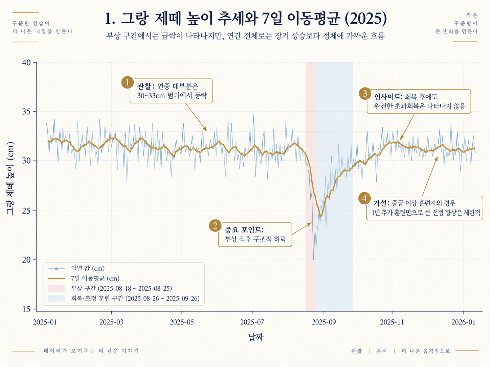

### 그래프를 왜 그렸는가

하루하루의 그랑 제떼 높이는 변동이 커서 원자료만 보면 장기 흐름을 파악하기 어렵습니다. 그래서 **일별 값**과 함께 **7일 이동평균**을 겹쳐 그려, 일시적인 출렁임을 줄이고 한 주 단위의 흐름을 확인하도록 했습니다. 또한 2025-08-18 이후의 부상·회복 구간을 색으로 구분해, 기술 수행의 하락이 어느 시점에서 시작되고 어떻게 회복되는지 한눈에 볼 수 있게 했습니다.

### 관찰

- 연중 대부분의 그랑 제떼 높이는 대체로 **30~33cm 부근**에서 등락합니다.
- 2025-08-18 전후 부상 구간에서 일별 값과 7일 이동평균이 함께 급락합니다.
- 회복기에는 다시 상승하지만, 연말까지 **부상 전 수준을 크게 넘어서는 장기 상승**은 나타나지 않습니다.
- 따라서 1년 전체 시계열은 “꾸준히 우상향하는 성장곡선”이라기보다 **평상시 정체 → 부상으로 급락 → 부분 회복 → 다시 정체**에 가까운 형태입니다.

### 해석

- 데이터 설계 당시 **완전 회복 또는 초과회복을 전제로 하지 않았기 때문에**, 부상 후 기술 지표가 이전 수준에 근접하더라도 확실히 넘어서는 형태가 나타나지 않았을 가능성이 큽니다.
- 또한 이 데이터가 가정한 대상이 초보자가 아니라 **중급 이상 수준의 훈련자**라면, 1년 동안 추가 연습을 했다고 해서 기술 지표가 계속 직선적으로 증가하기보다 정체 구간이 나타나는 설정이 더 자연스럽게 설계되었을 수 있습니다.
- 다만 이 두 설명 중에서는 **“부상 후 완전 회복을 전제로 하지 않은 데이터 설계의 영향”이 그래프 형태에 더 직접적인 영향**을 준 것으로 보는 것이 안전합니다.

### 인사이트

이 그래프의 핵심은 “1년 연습했으니 실력이 계속 올라야 한다”가 아니라, **구조적 사건인 부상이 장기 흐름을 바꾸고 그 영향이 연말까지 남을 수 있다**는 점입니다. 따라서 전체 1년을 단순한 성장률 하나로 요약하기보다 **부상 전·부상 중·회복 후를 나누어 해석해야 한다**는 근거가 됩니다.

**한 문장 설명:**  
“7일 이동평균으로 일별 노이즈를 줄여 보니, 이 데이터는 장기 우상향보다 부상에 의한 구조적 하락과 부분 회복이 더 강한 특징을 보였습니다.”

---

## 2. 요일별 평균 연습시간 vs 피로도

**파일명:** `02_weekly_seasonality.png`

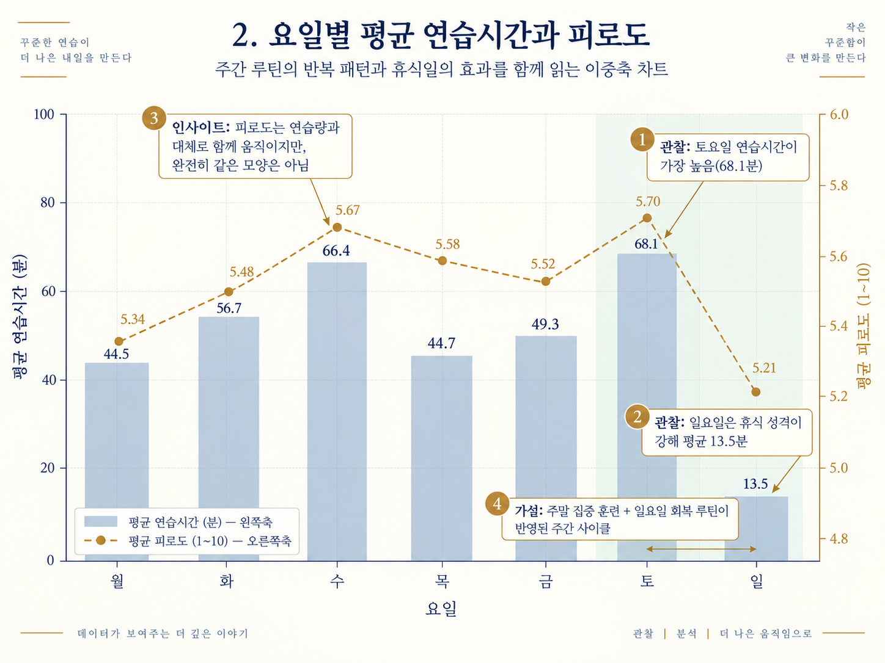

### 그래프를 왜 그렸는가

요일별 훈련 루틴이 반복되는지를 확인하기 위해 **요일별 평균 연습시간**과 **요일별 평균 피로도**를 함께 비교했습니다. 연습시간과 피로도는 단위가 다르므로 왼쪽 축과 오른쪽 축을 분리한 이중축 그래프로 표현했습니다.

### 관찰

- 평균 연습시간은 **토요일 68.1분**으로 가장 높습니다.
- 평균 연습시간은 **일요일 13.5분**으로 가장 낮아 휴식일 성격이 뚜렷합니다.
- 평균 피로도는 월 5.34, 화 5.48, 수 5.67, 목 5.58, 금 5.52, 토 5.70, 일 5.21로, 대체로 연습시간이 많은 요일에서 높지만 두 선이 완전히 같은 모양은 아닙니다.

### 해석

토요일의 집중 훈련과 일요일의 짧은 연습 또는 휴식이 반복되는 **주간 루틴**이 데이터 생성 구조에 반영된 것으로 볼 수 있습니다. 피로도는 당일 연습량만으로 결정되는 것이 아니라 전날의 훈련 영향이 일부 남아 있을 수 있으므로, 연습시간 막대와 피로도 선이 완전히 일치하지 않는 형태가 나타날 수 있습니다.

### 인사이트

요일 평균은 단순한 “토요일에 많이 한다”는 정보보다, **주간 훈련–회복 사이클이 데이터에 존재한다**는 점을 보여줍니다. 이 결과는 9번 지연효과 그래프와 연결해 해석할 때 더 설득력이 있습니다.

**한 문장 설명:**  
“요일별 평균을 비교하면 토요일 집중 훈련과 일요일 회복이라는 7일 주기 구조가 보이며, 피로도는 당일 훈련량과 완전히 동일하게 움직이지 않아 지연효과를 추가로 확인했습니다.”

---

## 3. 지표 간 상관관계 히트맵

**파일명:** `03_correlation_heatmap.png`

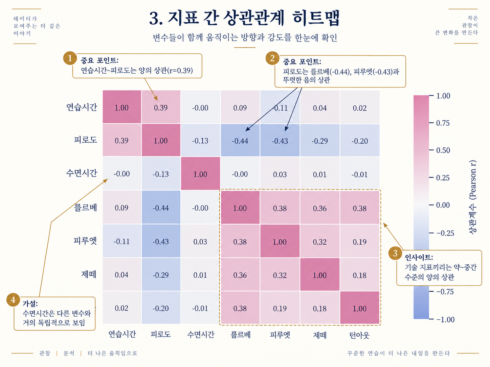

### 그래프를 왜 그렸는가

여러 변수 쌍의 선형 관계를 한 번에 비교하기 위해 Pearson 상관계수를 히트맵으로 표현했습니다. 색의 방향은 양·음의 상관을, 숫자는 상관계수의 크기를 보여줍니다.

### 관찰

- 연습시간–피로도는 **r=0.39**로 양의 상관입니다.
- 피로도–를르베는 **r=-0.44**, 피로도–피루엣은 **r=-0.43**으로 비교적 뚜렷한 음의 상관을 보입니다.
- 피로도–제떼는 **-0.29**, 피로도–턴아웃은 **-0.20**입니다.
- 기술 지표끼리는 약~중간 수준의 양의 상관을 보입니다. 예를 들어 를르베–피루엣 0.38, 를르베–제떼 0.36, 를르베–턴아웃 0.38입니다.
- 수면시간은 대부분의 변수와 거의 0에 가까운 상관을 보입니다.

### 해석

피로도가 높을수록 균형이나 정밀 조절이 필요한 기술 수행이 낮아지는 구조가 데이터 생성 과정에 반영되었을 가능성이 있습니다. 반면 수면시간은 다른 변수와 직접적으로 강하게 연결되도록 설계되지 않았기 때문에 상관이 약하게 나타난 것으로 볼 수 있습니다.

### 인사이트

상관계수는 **인과관계를 증명하지 않습니다**. 하지만 어떤 변수 조합을 응용2 AI 비서가 우선적으로 함께 조회해야 하는지 후보를 정하는 데 유용합니다. 특히 피로도는 여러 기술 지표와 동시에 음의 상관을 보여, 단순 연습시간보다 중요한 상태 변수로 활용할 가치가 있습니다.

**중요 :** 이 히트맵은 **전체 1년 데이터의 평균적 관계**입니다. 정상·부상·회복 구간을 따로 계산하면 상관계수는 달라질 수 있으므로, “항상 r=-0.44이다”라고 일반화하면 안 됩니다.

---

## 4. 부상 단계별 성과 비교

**파일명:** `04_injury_phase_comparison.png`

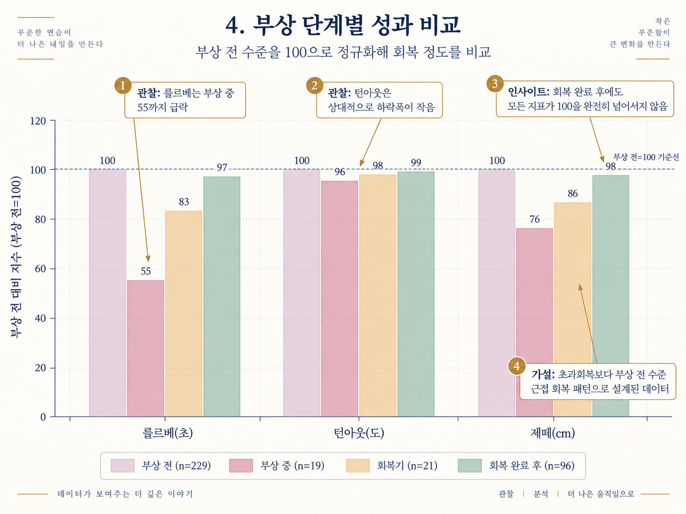

### 그래프를 왜 그렸는가

를르베·턴아웃·제떼는 단위가 서로 달라 원값을 그대로 한 그래프에 놓으면 비교가 어렵습니다. 그래서 **부상 전 평균을 100으로 정규화**하고, 부상 중·회복기·회복 완료 후의 값을 상대지수로 바꿔 비교했습니다.

### 관찰

- 를르베는 부상 중 **55**로 가장 크게 하락합니다.
- 턴아웃은 부상 중에도 **96**으로 하락폭이 작습니다.
- 제떼는 부상 중 **76**, 회복기 **86**, 회복 완료 후 **98** 수준입니다.
- 회복 완료 후 세 지표 모두 부상 전 기준선 100에 매우 가까워지지만 **완전히 넘어서지는 않습니다**.

### 해석

이 데이터는 부상 후 “초과회복”보다 **부상 전 수준에 근접하는 회복**을 가정한 구조입니다. 특히 를르베는 균형 유지 시간이므로 발목 부상에 상대적으로 민감하게 설계되었고, 턴아웃은 단기간에 크게 변하지 않는 느린 지표로 설계되어 하락폭이 작았을 가능성이 있습니다.

### 인사이트

부상의 영향은 기술마다 동일하지 않습니다. 따라서  “부상 후 회복률”을 하나의 숫자로 말하기보다 **기술별 회복률을 따로 설명해야 한다**는 근거가 됩니다. 또한 1번 그래프에서 보인 “연말의 정체”가 단순 노이즈가 아니라 **완전 회복을 전제로 하지 않은 데이터 설계와 연결**된다는 점을 보여줍니다.

---

## 5. STL 시계열 분해 — 그랑 제떼 높이

**파일명:** `05_stl_decomposition.png`

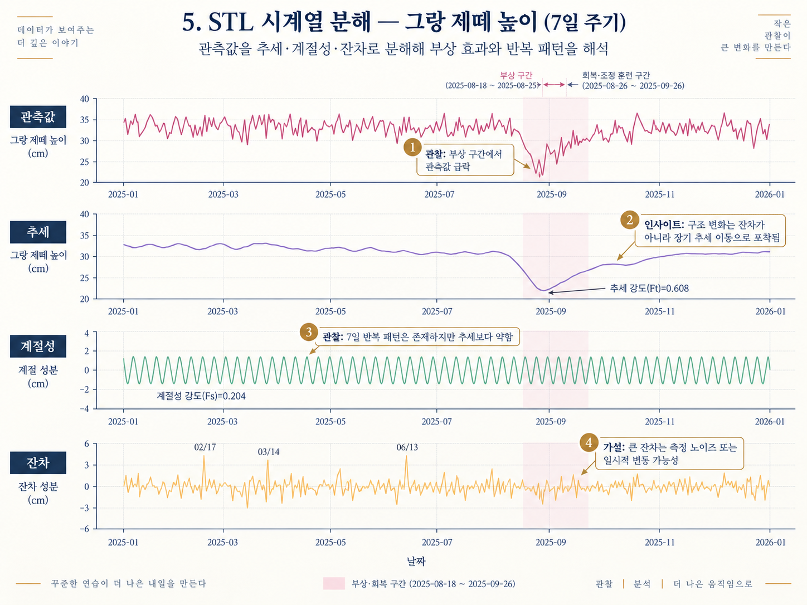

### 그래프를 왜 그렸는가

STL은 관측 시계열을 **추세(Trend) + 계절성(Seasonal) + 잔차(Residual)** 로 분해하여, 눈에 보이는 변화가 장기 흐름인지, 반복 주기인지, 설명되지 않는 일시 변동인지 구분하기 위한 방법입니다. 이 분석에서는 일별 자료의 주간 루틴을 확인하기 위해 **7일 주기**를 사용했습니다.

### 관찰

- 관측값에서는 부상 구간에서 그랑 제떼 높이가 명확하게 급락합니다.
- 추세 성분은 부상 구간에서 약 30cm대에서 22cm대까지 내려간 뒤 서서히 회복합니다.
- **추세 강도 Ft=0.608**입니다.
- **계절성 강도 Fs=0.204**로, 7일 반복 패턴은 존재하지만 추세보다 약합니다.
- 잔차에는 02/17, 03/14, 06/13 등에서 비교적 큰 스파이크가 보입니다.

### 해석

부상의 영향이 단순한 하루짜리 이상치였다면 잔차에서만 크게 나타났을 가능성이 있습니다. 그러나 실제 분해에서는 부상 구간이 **추세 자체의 하락**으로 포착되므로, 이 사건은 데이터의 평균 수준을 일정 기간 바꾼 구조 변화로 해석할 수 있습니다. 반면 큰 잔차 스파이크는 측정 노이즈나 일시적 컨디션 변동으로 볼 수 있습니다.

### 인사이트

STL을 사용하는 가장 중요한 이유는 “그래프가 내려갔다”는 관찰을 넘어서, **무엇이 장기 흐름이고 무엇이 반복 패턴이며 무엇이 나머지 변동인지 분리해서 설명할 수 있기 때문**입니다. 이번 데이터에서는 계절성보다 부상·회복에 따른 추세 이동이 더 중요한 특징입니다.

**한 문장 설명:**  
“STL로 분해했을 때 부상 효과가 잔차가 아니라 추세의 이동으로 나타났기 때문에, 단순 이상치가 아니라 일정 기간 지속된 구조 변화로 해석했습니다.”

---

## 6. ARIMA(1,1,1) 14일 예측 — 그랑 제떼 높이

**파일명:** `06_arima_forecast.png`

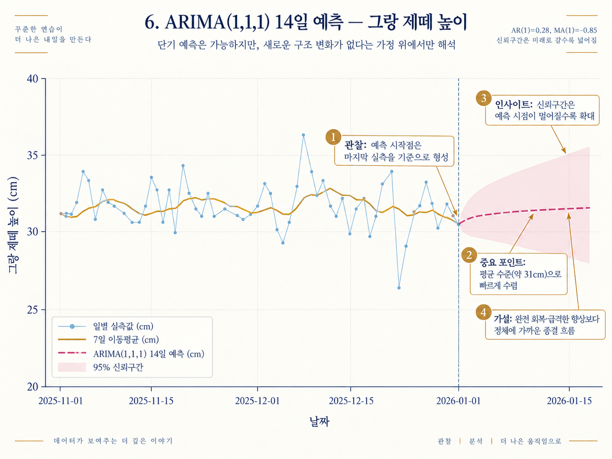

### 그래프를 왜 그렸는가

보너스 과제의 “간단 예측” 요구를 충족하면서, 과거 시계열 패턴만 이용하는 예측이 어디까지 가능한지 확인하기 위해 ARIMA(1,1,1)을 사용했습니다. 그래프에는 최근 실측값, 7일 이동평균, 14일 예측값, 95% 신뢰구간을 함께 표시했습니다.

### 관찰

- 예측 시작값은 약 **30.46cm** 부근이며, 며칠 안에 **31cm 안팎**으로 수렴합니다.
- AR(1)=0.28, MA(1)=-0.85로 표시되어 있습니다.
- 미래로 갈수록 95% 신뢰구간이 넓어져 예측 불확실성이 커집니다.
- 연말 시계열과 예측 모두 **뚜렷한 상승보다 정체 또는 약한 하향 흐름**에 가깝습니다.

### 해석

ARIMA는 기본적으로 “과거 패턴이 어느 정도 이어진다”는 전제 위에서 예측합니다. 이 데이터는 부상 이후 완전한 초과회복을 전제로 하지 않았고, 중급 이상 수준의 훈련자가 단기간에 큰 폭으로 선형 향상하지 않는 형태로 구성되어 있어 예측도 평균 수준에 가까운 값으로 수렴합니다. 다만 이번 그래프의 평평한 예측 형태에는 **중급 이상 훈련자의 성장 정체와 부상 후 완전 회복을 가정하지 않은 데이터 설계의 영향과 함께 해석하는 것이 타당합니다.

### 인사이트

예측값 자체보다 중요한 것은 **예측의 한계**입니다. 미래에 새로운 부상 같은 구조 변화가 발생하면 과거 정상 패턴만 학습한 ARIMA는 이를 미리 알 수 없습니다. 따라서 이 예측은 “미래에 새로운 구조 변화가 없다”는 조건부 예측으로 설명해야 합니다.

**한 문장으로:**  
“ARIMA는 정상 상태의 단기 흐름은 예측할 수 있지만, 부상처럼 데이터 생성 구조 자체를 바꾸는 사건은 예측하지 못하므로 신뢰구간과 가정을 함께 설명했습니다.”

---

## 7. 훈련부하(AU) 추이와 부상 전조 신호

**파일명:** `07_workload_injury_precursor.png`

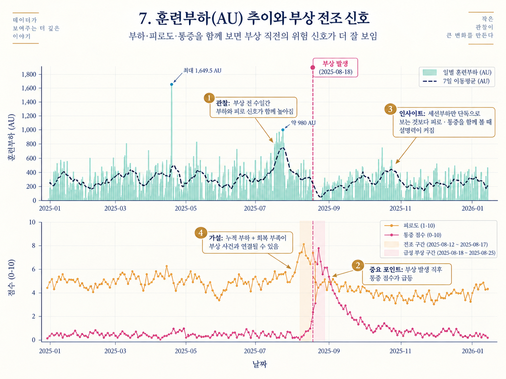

### 그래프를 왜 그렸는가

세션부하(AU), 피로도, 통증을 같은 시간축에 놓아 **부상 발생 전후의 상태 변화**를 확인하기 위한 그래프입니다. 단일 변수만 보면 놓칠 수 있는 위험 신호를 여러 변수의 동시 변화로 살펴봅니다.

### 관찰

- 전체 기간의 최대 세션부하는 **1,649.5 AU**이며, 집중워크숍 구간의 설명 가능한 특수값입니다.
- 공연주간에는 약 980~995 AU 수준의 높은 부하가 나타납니다.
- 부상 직전 일주일에는 8/13 **476.1 AU**, 8/16 **445.7 AU**의 고부하가 관찰됩니다.
- 2025-08-18 부상 발생 직후 통증 점수가 **0.6에서 7.2로 급등**합니다.

### 해석

부상 직전 고부하와 피로 상승이 시간적으로 가까이 나타났기 때문에 “누적 부하와 회복 부족이 영향을 주었을 가능성”을 가설로 세울 수 있습니다. 그러나 보고서의 검증처럼 ACWR이 과부하 기준을 넘지 않았으므로, **훈련부하가 부상의 원인이라고 단정할 수는 없습니다**.

### 인사이트

이 그래프는 인과관계를 증명하는 그림이 아니라 **전조 신호를 여러 변수로 함께 보는 방법**을 보여주는 그림입니다. 응용2 AI 비서에서는 “AU가 높으니 부상 위험”이라고 단정하기보다, **최근 부하·피로·통증의 조합과 변화 방향**을 함께 경고하는 방식이 더 적절합니다.

---

## 8. 지표별 훈련부하 기반 예측 설명력(R²) 비교

**파일명:** `08_prediction_r2_comparison.png`

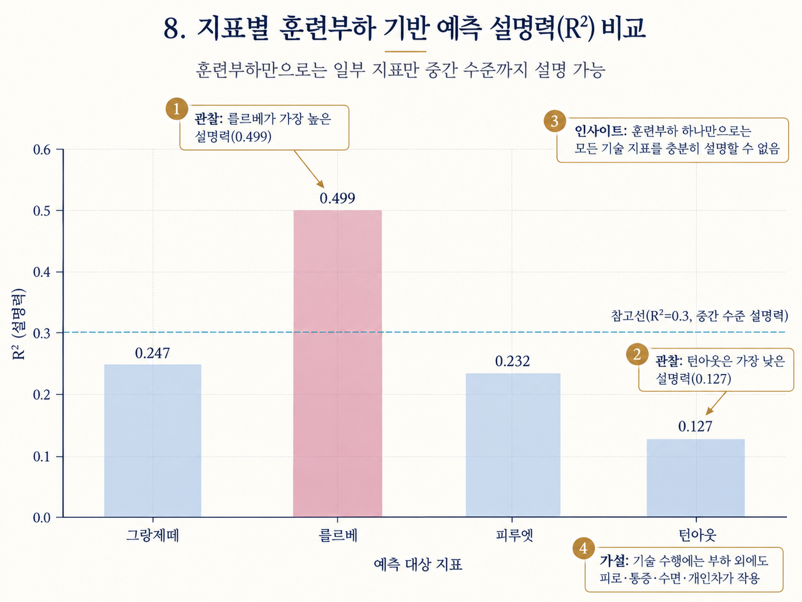

### 그래프를 왜 그렸는가

훈련부하·컨디션 변수로 네 기술 지표를 예측했을 때, 모델의 설명력이 기술마다 같은지 비교하기 위해 R²를 한 그래프에 표시했습니다.

### 관찰

- 를르베: **R²=0.499**
- 그랑 제떼: **R²=0.247**
- 피루엣: **R²=0.232**
- 턴아웃: **R²=0.127**
- 참고선 R²=0.3을 넘는 것은 를르베뿐입니다.

### 해석

를르베는 그날의 피로와 균형 상태에 민감한 “컨디션형 지표”이기 때문에 훈련부하·피로도 같은 일별 변수로 상대적으로 더 설명될 수 있습니다. 반면 턴아웃은 단기간 변화보다 유연성·구조적 특성에 가까운 느린 지표로 설정되어 예측 설명력이 낮게 나타난 것으로 볼 수 있습니다.

### 인사이트

“훈련부하로 기술을 예측할 수 있는가?”라는 질문에 하나의 답을 주면 안 됩니다. **지표에 따라 예측 가능성이 다르다**가 정확한 결론입니다. 

---

## 9. 훈련부하의 지연효과(Lag Effect)

**파일명:** `09_lag_effect.png`

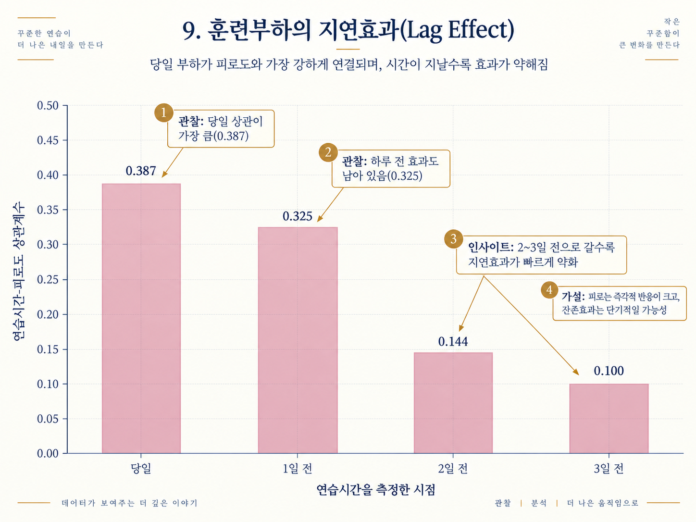

### 그래프를 왜 그렸는가

당일 연습시간만 피로도와 비교하면 “전날 훈련의 여파”를 놓칠 수 있습니다. 그래서 연습시간을 당일, 1일 전, 2일 전, 3일 전으로 한 칸씩 이동시켜 피로도와의 상관을 비교했습니다.

### 관찰

- 당일: **0.387**
- 1일 전: **0.325**
- 2일 전: **0.144**
- 3일 전: **0.100**
- 시간이 멀어질수록 상관이 빠르게 감소합니다.

### 해석

피로 반응은 당일 훈련에 가장 크게 반응하고, 하루 정도는 잔존하지만 2~3일이 지나면 영향이 빠르게 약해지도록 설계된 것으로 볼 수 있습니다.

### 인사이트

요일별 그래프에서 일요일 훈련시간이 짧은데도 피로도가 즉시 최저로 떨어지지 않는 이유를 설명하는 보조 근거가 됩니다. AI 비서가 피로를 설명할 때 **당일 데이터뿐 아니라 최근 1~2일 기록도 함께 보는 것**이 유용하다는 설계 근거가 됩니다.

---

## 10. [추가] 훈련부하(AU)와 피로도의 관계 — 산점도

**파일명:** `10_scatter_au_fatigue.png`

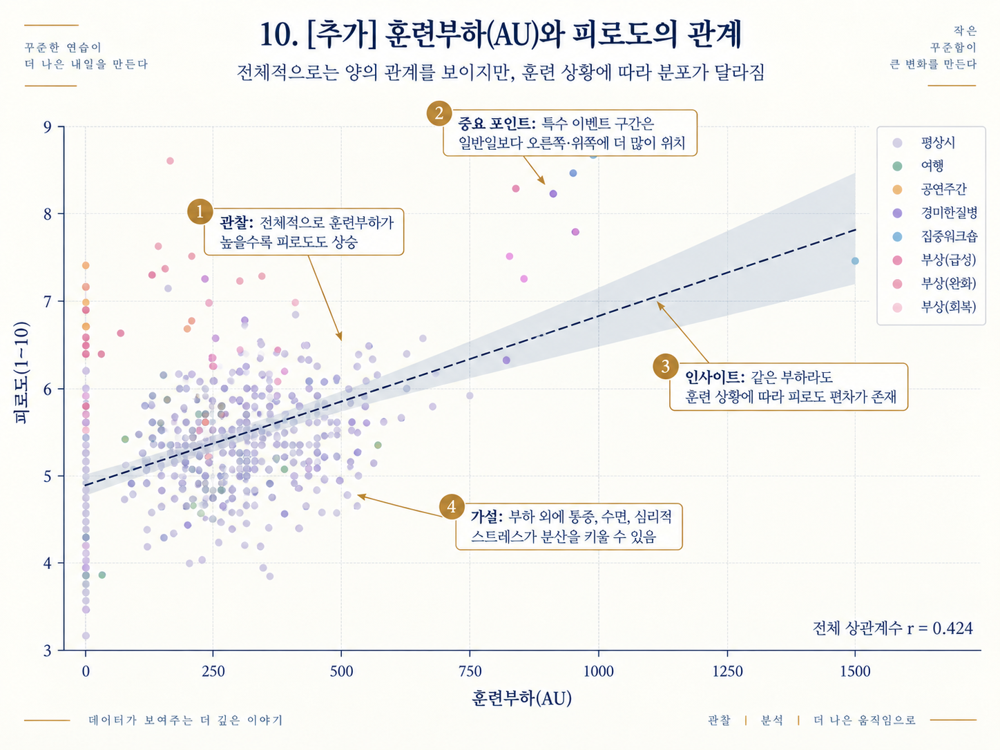

### 그래프를 왜 그렸는가

상관계수 하나만 보면 전체적인 직선 관계는 알 수 있지만, 실제 점들이 **어떻게 퍼져 있는지**, 특정 훈련 상황에서 분포가 달라지는지는 알기 어렵습니다. 그래서 훈련부하와 피로도를 산점도로 표현하고 event_type별로 점을 구분했습니다.

### 관찰

- 전체 상관계수는 **r=0.424**로 양의 관계입니다.
- 전체적으로 훈련부하가 높을수록 피로도도 높아지는 경향이 있습니다.
- 공연주간·집중워크숍·부상 관련 점들은 평상시 점보다 상대적으로 오른쪽 또는 위쪽에 위치하는 경우가 많습니다.
- 같은 AU 값에서도 피로도가 한 값으로 모이지 않고 넓게 퍼집니다.

### 해석

같은 훈련부하라도 피로도는 통증, 수면, 훈련 상황, 심리적 스트레스 등 다른 변수의 영향을 받기 때문에 분산이 커질 수 있습니다.

### 인사이트

전체 상관계수 r=0.424만 보고 “AU가 피로도를 결정한다”고 말하면 과도한 해석입니다. 산점도는 **같은 부하에서도 피로가 달라질 수 있다는 개인 상태의 맥락**을 보여줍니다. 따라서 응용2 AI 비서에서는 훈련부하와 함께 event_type·통증·수면 같은 문맥 변수를 함께 조회하는 것이 적절합니다.

---

## 11. [추가] 훈련 상황별 피로도 분포 — 박스플롯

**파일명:** `11_boxplot_fatigue_by_event.png`

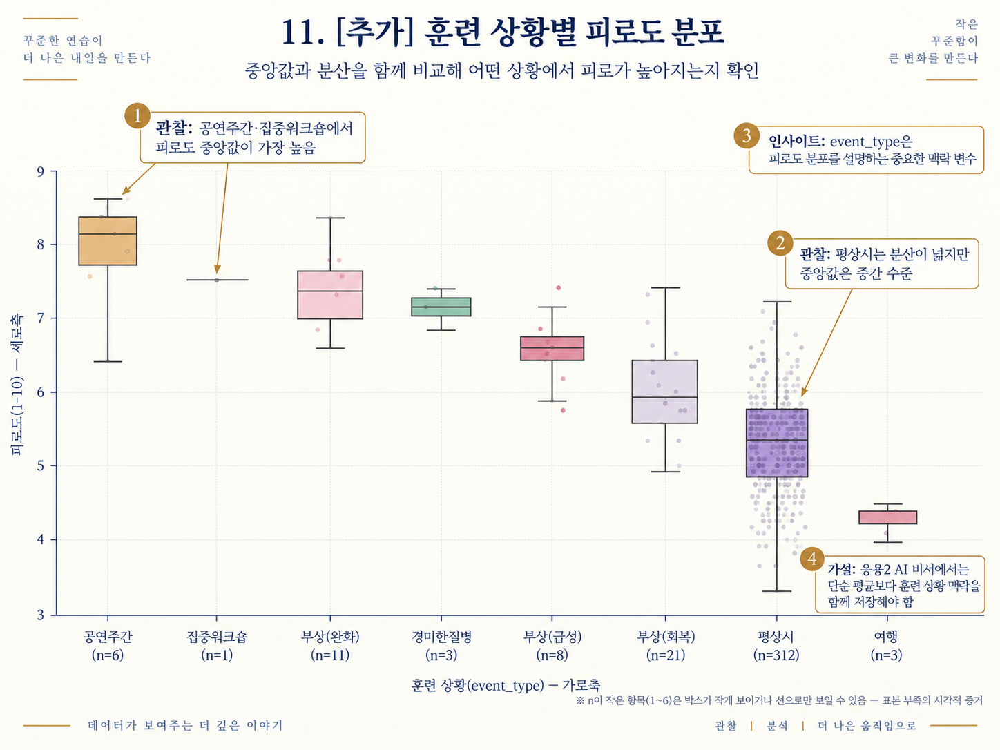

### 그래프를 왜 그렸는가

평균값 하나만으로는 각 훈련 상황의 **중앙값, 퍼짐, 이상값, 표본 수 차이**를 동시에 보기 어렵습니다. 박스플롯을 사용하면 event_type별 피로도의 중심과 분포를 비교할 수 있습니다.

### 관찰

- 공연주간(n=6)과 집중워크숍(n=1)은 피로도 수준이 가장 높게 나타납니다.
- 부상(완화), 경미한질병, 부상(급성), 부상(회복) 순으로 비교적 높은 피로 분포가 이어집니다.
- 평상시(n=312)는 표본 수가 가장 많아 분산이 넓게 보이지만 중앙값은 중간 수준입니다.
- 여행(n=3)은 상대적으로 낮은 피로 수준에 위치합니다.
- n=1~6처럼 표본 수가 매우 적은 항목은 박스가 거의 보이지 않거나 선처럼 나타날 수 있습니다.

### 해석

피로도는 단순히 연습시간이나 AU뿐 아니라 **현재 훈련 상황 자체**에 따라 분포가 달라지도록 설계되어 있습니다. 
### 인사이트

“전체 평균 피로도 5.50” 같은 한 숫자로는 숨겨지는 **상황별 차이**를 보여줍니다. “최근 피로도는 높다/낮다”뿐 아니라 “공연주간인지, 부상 회복기인지, 평상시인지”를 함께 설명해야합니다.

---

